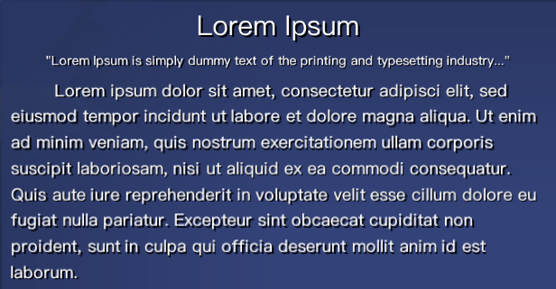
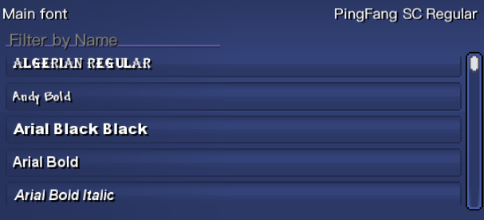
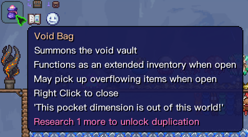

<h1 align="center">Terraria Font Loader</h1>

<div align="center">

English | [简体中文](./README.zh.md)

A mod that lets you freely choose the fonts displayed in the game

Fonts in .ttf, .otf and .ttc formats are currently supported

</div>

## ✨ Features
1. Allows you to freely choose the game font
2. Adjustable font size
3. Shadow mode to make fonts look better
4. The built-in Ping Fang font matches well with Terraria

## 🧩 Screenshots

<br/>

<br/>


## 🛡️ Safety Statements
In order to use the mod, it will copy a `freetype6.dll` file to the user's computer, which is necessary. If you lack this file, you will not be able to use any functions of this mod

This file is completely safe, if you don't believe the file I provided, you can download this file from the [FreeType official website](https://www.freetype.org/), and then put it in `%SteamInstallationFolder%\Steam\steamapps \common\tModLoader\Libraries\Native\Windows\` folder. Or just don't use the mod

## 📗 Copyright Statements
The built-in font of this mod is "[PingFang SC Regular](https://zh.wikipedia.org/zh-cn/%E8%8B%B9%E6%96%B9)", which is not used for commercial purposes, are used only inside the mod and are not used for other purposes.

This mod includes the open source library [Velentr.Font](https://github.com/vonderborch/Velentr.Font) in the source code, and modifies part of the content to meet the needs of the mod. The Velentr.Font library itself is open sourced under the [MIT License](https://en.wikipedia.org/wiki/MIT_License)

The MIT license of Velentr.Font has been declared in the [LICENSE](LICENSE) file of this mod. According to the above description, this mod does not have any infringement

This mod also uses [SharpFont Library](https://github.com/squid-box/SevenZipSharp) and [Velentr.Collections Library](https://github.com/vonderborch/Velentr.Collections), the license is also stated in the [LICENSE](LICENSE) file of this mod

This mod uses the [SevenZipSharp library](https://github.com/squid-box/SevenZipSharp) under [LGPL v3.0](https://en.wikipedia.org/wiki/GNU_Lesser_General_Public_License). The license allows developers and companies to use and integrate a software component released under the LGPL into their own (even proprietary) software without being required by the terms of a strong copyleft license to release the source code of their own components.

The Windows binary of FreeType that is included in the project is redistributed under the FreeType License (FTL).

```
Portions of this software are copyright (c) 2016 The FreeType Project
(www.freetype.org). All rights reserved.
```

### 📃 License
The terms of the MIT license are included in the [LICENSE](LICENSE) file, as follows:
```text
MIT License

Copyright (c) 2023 Cyrilly

Velentr.Font is used, Copyright (c) 2021 Christian Webber
SharpFont is used, Copyright (c) 2012-2016 Robert Rouhani <robert.rouhani@gmail.com>
Velentr.Collections is used, Copyright (c) 2022 Christian Webber

Permission is hereby granted, free of charge, to any person obtaining a copy
of this software and associated documentation files (the "Software"), to deal
in the Software without restriction, including without limitation the rights
to use, copy, modify, merge, publish, distribute, sublicense, and/or sell
copies of the Software, and to permit persons to whom the Software is
furnished to do so, subject to the following conditions:

The above copyright notice and this permission notice shall be included in all
copies or substantial portions of the Software.

THE SOFTWARE IS PROVIDED "AS IS", WITHOUT WARRANTY OF ANY KIND, EXPRESS OR
IMPLIED, INCLUDING BUT NOT LIMITED TO THE WARRANTIES OF MERCHANTABILITY,
FITNESS FOR A PARTICULAR PURPOSE AND NONINFRINGEMENT. IN NO EVENT SHALL THE
AUTHORS OR COPYRIGHT HOLDERS BE LIABLE FOR ANY CLAIM, DAMAGES OR OTHER
LIABILITY, WHETHER IN AN ACTION OF CONTRACT, TORT OR OTHERWISE, ARISING FROM,
OUT OF OR IN CONNECTION WITH THE SOFTWARE OR THE USE OR OTHER DEALINGS IN THE
SOFTWARE.
```