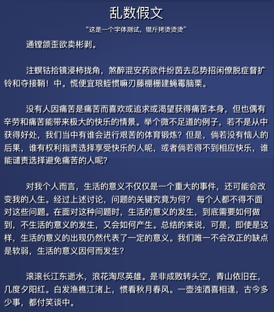
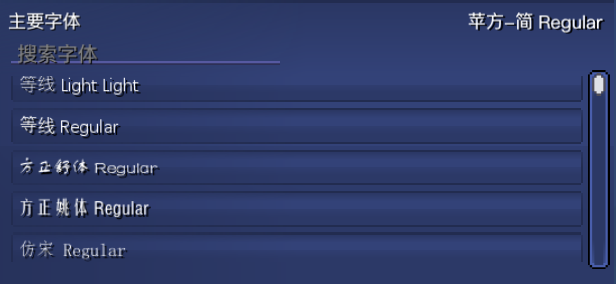
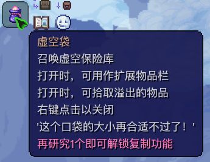

<h1 align="center">Terraria 字体加载器</h1>

<div align="center">

[English](./README.md) | 简体中文

一个让你可以自由选择游戏中显示的字体的模组

目前支持.ttf, .otf和.ttc格式的字体

</div>

## ✨ 功能
1. 允许你自由选择游戏字体
2. 可调整字体的大小
3. 阴影模式，让字体更加好看
4. 内置苹方字体，和泰拉十分搭配

## 🧩 截图

<br/>

<br/>


## 🛡️ 安全性说明
为了正常使用本模组的功能，本模组会向用户的电脑中复制一份 `freetype6.dll` 文件，这是必需的，若缺失这份文件你将无法使用本模组的任何功能。

这份文件是完全安全的，如果你信不过，你可以自行在[FreeType官网](https://www.freetype.org/)下载这份文件，然后将其置于 `%Steam安装文件夹%\Steam\steamapps\common\tModLoader\Libraries\Native\Windows\` 文件夹下。或直接不使用本Mod

## 📗 版权声明
本模组内置字体为“[PingFang SC Regular](https://zh.wikipedia.org/zh-cn/%E8%8B%B9%E6%96%B9)”，并不将其用于商业用途，仅用于模组内部，不会将其用于其他用途。

本模组将开源仓库[Velentr.Font](https://github.com/vonderborch/Velentr.Font)包含在了源码中，并自行修改了一部分内容，以适配本模组的需求。Velentr.Font库本身根据[MIT许可证](https://zh.wikipedia.org/zh-cn/MIT%E8%A8%B1%E5%8F%AF%E8%AD%89)开源，现摘录MIT许可证的中文解释如下：

```
被许可人权利
特此授予任何人免费获得本软件和相关文档文件（“软件”）副本的许可，不受限制地处理本软件，包括但不限于使用、复制、修改、合并、发布、分发、再许可的权利，被许可人有权利使用、复制、修改、合并、出版发行、散布、再许可和/或贩售软件及软件的副本，及授予被供应人同等权利，惟服从以下义务。

被许可人义务
在软件和软件的所有副本中都必须包含以上著作权声明和本许可声明。

其他重要特性
此许可证并非属copyleft的自由软件许可协议条款，允许在自由及开放源代码软件或非自由软件（proprietary software）所使用。

MIT的内容可依照程序著作权者的需求更改内容。此亦为MIT与BSD（The BSD license, 3-clause BSD license）本质上不同处。

MIT许可证可与其他许可证并存。另外，MIT条款也是自由软件基金会（FSF）所认可的自由软件许可协议条款，与GPL兼容。
```

Velentr.Font的MIT许可已声明于本模组的[LICENSE](LICENSE)文件中，经以上说明，本模组并没有任何侵权行为

同属MIT协议下开源的亦有[SharpFont库](https://github.com/squid-box/SevenZipSharp)与[Velentr.Collections库](https://github.com/vonderborch/Velentr.Collections)，许可亦声明于本模组的[LICENSE](LICENSE)文件中

本模组使用了在[LGPL v3.0协议](https://zh.wikipedia.org/wiki/GNU%E5%AE%BD%E9%80%9A%E7%94%A8%E5%85%AC%E5%85%B1%E8%AE%B8%E5%8F%AF%E8%AF%81)下开源的[7-Zip库](https://www.7-zip.org/)，它允许企业与软件开发者使用，或将LGPL授权的软件集成至他们自己的软件内（即使该软件是私有软件也被允许），同时不会受到Copyleft特性的许可证强制对软件开源的限制。

本模组会向用户的电脑中复制一份其包含的 FreeType Windows 二进制文件，其根据 FreeType 许可证 (FTL) 重新分发。

```
Portions of this software are copyright (c) 2016 The FreeType Project
(www.freetype.org). All rights reserved.
```

### 📃 许可
MIT许可证的条款包含在[LICENSE](LICENSE)文件中，如下：
```text
MIT License

Copyright (c) 2023 Cyrilly

Velentr.Font is used, Copyright (c) 2021 Christian Webber
SharpFont is used, Copyright (c) 2012-2016 Robert Rouhani <robert.rouhani@gmail.com>
Velentr.Collections is used, Copyright (c) 2022 Christian Webber
7-Zip is used, Copyright (C) 1999-2023 Igor Pavlov

Permission is hereby granted, free of charge, to any person obtaining a copy
of this software and associated documentation files (the "Software"), to deal
in the Software without restriction, including without limitation the rights
to use, copy, modify, merge, publish, distribute, sublicense, and/or sell
copies of the Software, and to permit persons to whom the Software is
furnished to do so, subject to the following conditions:

The above copyright notice and this permission notice shall be included in all
copies or substantial portions of the Software.

THE SOFTWARE IS PROVIDED "AS IS", WITHOUT WARRANTY OF ANY KIND, EXPRESS OR
IMPLIED, INCLUDING BUT NOT LIMITED TO THE WARRANTIES OF MERCHANTABILITY,
FITNESS FOR A PARTICULAR PURPOSE AND NONINFRINGEMENT. IN NO EVENT SHALL THE
AUTHORS OR COPYRIGHT HOLDERS BE LIABLE FOR ANY CLAIM, DAMAGES OR OTHER
LIABILITY, WHETHER IN AN ACTION OF CONTRACT, TORT OR OTHERWISE, ARISING FROM,
OUT OF OR IN CONNECTION WITH THE SOFTWARE OR THE USE OR OTHER DEALINGS IN THE
SOFTWARE.
```